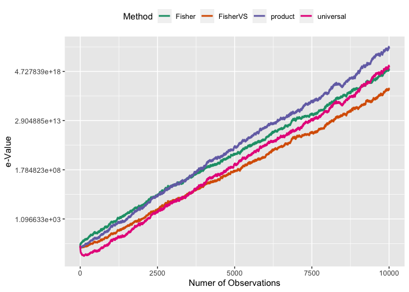

In this package, we provide e-value for four DMR (differentially
methylated region) detection tools (MethylKit, Metilene, BiSeq and
DMRfinder) and general purpose.

-   MethylKit
-   BiSeq
-   DMRfinder
-   Metilene
-   General purpose

## INSTALL

The `metevalue` pakcage is available on CRAN now, one could visit [metevalue](https://cran.r-project.org/web/packages/metevalue/) to get the CRAN version.

```R
install.package('metevalue')
``` 

Or use the `devtools` to install the development version on github. If you come across any problem when using this package, please file an issue/PR in this git project.

In this package, we provide e-value for four DMR (differentially methylated region) detection tools (MethylKit, Metilene, BiSeq and DMRfinder) and general purpose.

-   MethylKit
-   BiSeq
-   DMRfinder
-   Metilene
-   General purpose

For `DMR` (`methylKit`, `biseq`, `DMRfinder` or `metilene`), the met-evalue calculation is conducted by the `metevalue.[DMR]` function. 

| DMR | Method | methyrate Example | Method.output Example |
|:-----|:-----|:-----|:-----|
| MethylKit | `metevalue.methylKit` | `data(demo_methylkit_methyrate)` |  `data(demo_methylkit_met_all)` | 
| BiSeq | `metevalue.biseq` | `data(demo_biseq_methyrate)` | `data(demo_biseq_DMR)` |
| DMRfinder | `metevalue.DMRfinder`|  `data(demo_DMRfinder_rate_combine)` | `data(demo_DMRfinder_DMRs)` |
| Metilene | `metevalue.metilene` | `data(demo_metilene_input)` | `data(demo_metilene_out)` |

Two routines are supported to calculate the combined e-value:

- Call by **files**: Here the `files` include the outputs of given `DMR` packages and its corresponding e-value of each regions;
- Call by **R data frames**: Here the `R data frames` are corresponding `data.frame` objects.

Details are as follows.


## Call by files

We design the `metevalue.[DMR]` function to accept similar parameter patterns:

```{r eval=FALSE}
metevalue.[DMR](
  methyrate,                # Output file name of [DMR]
  [DMR].output,             # Output file name of [DMR] with e-value of each region
  adjust.methods = "BH",    # Adjust methods of e-value
  sep = "\t",               # seperator, default is the TAB key.
  bheader = FALSE           # A logical value indicating whether the [DMR].output file
                            # contains the names of the variables as its first line
)
```

Here  `[DMR]` coudle be one of `methylKit`, `biseq`, `DMRfinder` or `metilene`.

## Call by R data frames

We provide the `evalue_buildin_var_fmt_nm` and `varevalue.metilene` function to handle the general DMR e-value alculation in DNA methylation studiesc:

```{r eval=FALSE}
# Here  `[DMR]` coudle be one of `methylKit`, `biseq`, `DMRfinder` or `metilene`.
method_in_use = "[DMR]"
result = evalue_buildin_var_fmt_nm(
          methyrate,              # Data frame of the methylation rate
          DMR_evalue_output,      # Data frame of output data corresponding to the
                                  # "method" option
          method = method_in_use) # DMR: "metilene", "biseq", "DMRfinder" or "methylKit"
result = list(a = result$a,
              b = result$b,
              a_b = evalue_buildin_sql(result$a, result$b, method = method_in_use))
result = varevalue.metilene(result$a, result$b, result$a_b)
```

Replace `[DMR]` to one of `methylKit`, `biseq`, `DMRfinder` or `metilene` accordingly.

> !Notice: for different `[DMR]`, the `data.frame` schemas are **different**!!! Check the R help document for details.


## MethylKit Example

methylKit is a R package for DNA methylation analysis and annotation
from high-throughput bisulfite sequencing. The package is designed to
deal with sequencing data from RRBS and its variants, but also
target-capture methods and whole genome bisulfite sequencing.

Currently, `evalue` package supports the e-value analytics of the
`methylKit` output file.

``` r
library(metevalue)
#> Loading required package: sqldf
#> Loading required package: gsubfn
#> Loading required package: proto
#> Loading required package: RSQLite
#> Loading required package: psych
#> Loading required package: dplyr
#> 
#> Attaching package: 'dplyr'
#> The following objects are masked from 'package:stats':
#> 
#>     filter, lag
#> The following objects are masked from 'package:base':
#> 
#>     intersect, setdiff, setequal, union

####Simulation Data ####
set.seed(1234)

simu_g_value <- function(n, r = 0.1){
  x = runif(n)
  x[runif(n) <= r] = 0
  return(x);
}


library(methylKit)
#> Loading required package: GenomicRanges
#> Loading required package: stats4
#> Loading required package: BiocGenerics
#> 
#> Attaching package: 'BiocGenerics'
#> The following objects are masked from 'package:dplyr':
#> 
#>     combine, intersect, setdiff, union
#> The following objects are masked from 'package:stats':
#> 
#>     IQR, mad, sd, var, xtabs
#> The following objects are masked from 'package:base':
#> 
#>     anyDuplicated, append, as.data.frame, basename, cbind, colnames,
#>     dirname, do.call, duplicated, eval, evalq, Filter, Find, get, grep,
#>     grepl, intersect, is.unsorted, lapply, Map, mapply, match, mget,
#>     order, paste, pmax, pmax.int, pmin, pmin.int, Position, rank,
#>     rbind, Reduce, rownames, sapply, setdiff, sort, table, tapply,
#>     union, unique, unsplit, which.max, which.min
#> Loading required package: S4Vectors
#> 
#> Attaching package: 'S4Vectors'
#> The following objects are masked from 'package:dplyr':
#> 
#>     first, rename
#> The following objects are masked from 'package:base':
#> 
#>     expand.grid, I, unname
#> Loading required package: IRanges
#> 
#> Attaching package: 'IRanges'
#> The following objects are masked from 'package:dplyr':
#> 
#>     collapse, desc, slice
#> The following objects are masked from 'package:psych':
#> 
#>     distance, reflect
#> Loading required package: GenomeInfoDb
#> 
#> Attaching package: 'methylKit'
#> The following object is masked from 'package:dplyr':
#> 
#>     select
file.list=list( system.file("extdata", 
                            "test1.myCpG.txt", package = "methylKit"),
                system.file("extdata",
                            "test2.myCpG.txt", package = "methylKit"),
                system.file("extdata", 
                            "control1.myCpG.txt", package = "methylKit"),
                system.file("extdata", 
                            "control2.myCpG.txt", package = "methylKit") )


# read the files to a methylRawList object: myobj
myobj=methRead(file.list,
               sample.id=list("test1","test2","ctrl1","ctrl2"),
               assembly="hg18",
               treatment=c(1,1,0,0),
               context="CpG"
)
#> Received list of locations.
#> Reading file.
#> Reading file.
#> Reading file.
#> Reading file.

meth=unite(myobj, destrand=FALSE)
#> uniting...
meth.C <- getData(meth)[,seq(6,ncol(meth),3)]
meth.T <- getData(meth)[,seq(7,ncol(meth),3)]
mr <- meth.C/(meth.C + meth.T)
chr_pos = getData(meth)[,1:2]
methyrate = data.frame(chr_pos,mr)
names(methyrate) = c('chr', 'pos', rep('g1',2), rep('g2',2))
region<-tileMethylCounts(myobj)
meth<-unite(region,destrand=F)
#> uniting...
myDiff<-calculateDiffMeth(meth)
#> two groups detected:
#>  will calculate methylation difference as the difference of
#> treatment (group: 1) - control (group: 0)
met_all<-getMethylDiff(myDiff,type="all")

example_tempfiles = tempfile(c("rate_combine", "methylKit_DMR_raw"))
tempdir()
#> [1] "/var/folders/5_/cwswxkd94mncymd3qw_wv2b40000gn/T//Rtmpl3zM21"
write.table(methyrate, file=example_tempfiles[1], row.names=F, col.names=T, quote=F, sep='\t')
write.table (met_all, file=example_tempfiles[2], sep ="\t", row.names =F, col.names =T, quote =F)
```

`evalue.methylKit` function could be used to tackle the problem.

``` r
result = metevalue.methylKit(example_tempfiles[1], example_tempfiles[2], bheader = T)
#> Joining, by = c("start", "end")
str(result)
#> 'data.frame':    24 obs. of  9 variables:
#>  $ chr      : chr  "chr21" "chr21" "chr21" "chr21" ...
#>  $ start    : int  9927001 9944001 9959001 9967001 10011001 10077001 10087001 10186001 13664001 13991001 ...
#>  $ end      : int  9928000 9945000 9960000 9968000 10012000 10078000 10088000 10187000 13665000 13992000 ...
#>  $ strand   : chr  "*" "*" "*" "*" ...
#>  $ p        : num  2.47e-10 2.57e-21 4.39e-23 3.08e-04 2.02e-65 ...
#>  $ qvalue   : num  3.24e-10 9.58e-21 2.36e-22 2.37e-04 3.27e-64 ...
#>  $ meth.diff: num  -34.1 -40.2 -25.4 -25.9 25.8 ...
#>  $ e_value  : num  1.65 1.65 1.65 1.65 1.65 ...
#>  $ e_adjust : num  1.65 1.65 1.65 1.65 1.65 ...
```

Alternatively, one could use the build-in functions to derive functions
which avoid the file operation:

``` r
result = evalue_buildin_var_fmt_nm(methyrate, met_all, method="methylKit")
result = list(a = result$a, 
              b = result$b, 
              a_b = evalue_buildin_sql(result$a, result$b, method="methylKit"))
result = varevalue.metilene(result$a, result$b, result$a_b)
#> Joining, by = c("start", "end")
str(result)
#> 'data.frame':    24 obs. of  9 variables:
#>  $ chr      : Factor w/ 1 level "chr21": 1 1 1 1 1 1 1 1 1 1 ...
#>  $ start    : int  9927001 9944001 9959001 9967001 10011001 10077001 10087001 10186001 13664001 13991001 ...
#>  $ end      : int  9928000 9945000 9960000 9968000 10012000 10078000 10088000 10187000 13665000 13992000 ...
#>  $ strand   : Factor w/ 3 levels "+","-","*": 3 3 3 3 3 3 3 3 3 3 ...
#>  $ p        : num  2.47e-10 2.57e-21 4.39e-23 3.08e-04 2.02e-65 ...
#>  $ qvalue   : num  3.24e-10 9.58e-21 2.36e-22 2.37e-04 3.27e-64 ...
#>  $ meth.diff: num  -34.1 -40.2 -25.4 -25.9 25.8 ...
#>  $ e_value  : num  1.65 1.65 1.65 1.65 1.65 ...
#>  $ e_adjust : num  1.65 1.65 1.65 1.65 1.65 ...
```

## BiSeq Example

First, we load the methylation data at CpG site levels from ‘BiSeq’
package. Then we clustered CpG sites into DMRs using ‘BiSeq’.

``` r
library(BiSeq)
library(dplyr)
data(rrbs)
rrbs.rel <- rawToRel(rrbs)
methyrate <- methLevel(rrbs.rel)
methyrate <- data.frame(methyrate)
methyrateq = cbind(rows = as.numeric(row.names(methyrate)), methyrate)
methypos = data.frame(rows = as.numeric(row.names(methyrate)), rowRanges(rrbs))
methyrate = left_join(methypos, methyrateq)
methyrate = methyrate[,c(2,3,7:16)]
names(methyrate) <- c('chr','pos',rep('g1',5),rep('g2',5))

rrbs.clust.unlim <- clusterSites(object = rrbs,perc.samples = 3/4,min.sites = 20,max.dist = 100)

clusterSitesToGR(rrbs.clust.unlim)
ind.cov <- totalReads(rrbs.clust.unlim) > 0

quant <- quantile(totalReads(rrbs.clust.unlim)[ind.cov])
rrbs.clust.lim <- limitCov(rrbs.clust.unlim, maxCov = quant)
predictedMeth <- predictMeth(object = rrbs.clust.lim)

test<- predictedMeth[, colData(predictedMeth)$group == "test"]
control <- predictedMeth[, colData(predictedMeth)$group == "control"]
mean.test <- rowMeans(methLevel(test))
mean.control <- rowMeans(methLevel(control))

betaResults <- betaRegression(formula = ~group,link = "probit",object = predictedMeth,type = "BR")
vario <- makeVariogram(betaResults)
vario.sm <- smoothVariogram(vario, sill = 0.9)

locCor <- estLocCor(vario.sm)
clusters.rej <- testClusters(locCor)
clusters.trimmed <- trimClusters(clusters.rej)
DMRs <- findDMRs(clusters.trimmed,max.dist = 100,diff.dir = TRUE)


example_tempfiles = tempfile(c('rate_combine', 'BiSeq_DMR'))
write.table(methyrate, example_tempfiles[1], row.names=F, col.names=T, quote=F, sep='\t')
write.table(DMRs, example_tempfiles[2], quote=F, row.names = F,col.names = F, sep = '\t')
```

Finally, we added E-values and adjusted E-values as additional columns
to the output file of ‘BiSeq’.`BiSeq_evalue` function could be used to
tackle the problem.

``` r
hh <- data.frame(DMRs)
result = evalue_buildin_var_fmt_nm(rate_combine, hh, method="biseq")
result = list(a = result$a,  b = result$b, 
              a_b = evalue_buildin_sql(result$a, result$b,method="biseq"))
result = varevalue.metilene(result$a, result$b, result$a_b)
str(result)
```

## DMRfinder Example

Given the input file

-   `rate_combine_DMRfinder`: a file containing methylation rates at
    each CpG site

-   `DMRfinder_DMR`: the output file from ‘DMRfinder’

``` r
rate_combine <- read.table("rate_combine_DMRfinder", header = T)
head(rate_combine)

DMRs <- read.table("DMRfinder_DMR", header = T)
head(DMRs)
```

Adding E-values and adjusted E-values as additional columns to file
‘DMRfinder_DMR’

``` r
result <- evalue.DMRfinder('rate_combine_DMRfinder', 'DMRfinder_DMR')
head(result)
```

Alternatively, function `varevalue.metilene` can also provides e-value
and adjusted e-value.

``` r
result = evalue_buildin_var_fmt_nm(rate_combine, DMRs, method="DMRfinder")
result = list(a = result$a, 
              b = result$b, 
              a_b = evalue_buildin_sql(result$a, result$b, method="DMRfinder"))
result = varevalue.metilene(result$a, result$b, result$a_b)
head(result)
```

## Metilene Example

Given

-   `metilene.input`: the input file of `Metilene` containing
    methylation rates at each CpG site
-   `metilene.out`: the output file of `Metilene`

``` r
input <- read.table("metilene.input", header = T)
head(input)

out <- read.table("metilene.out", header = F)
head(out)
```

Adding E-values and adjusted E-values as additional columns to
`metilene.out`

``` r
result <- evalue.metilene('metilene.input', 'metilene.out')
head(result)
```

Alternatively, function `varevalue.metilene` can also provides e-value
and adjusted e-value.

``` r
result = evalue_buildin_var_fmt_nm(input, out, method="metilene")
result = list(a = result$a, 
              b = result$b, 
              a_b = evalue_buildin_sql(result$a, result$b, method="metilene"))
result = varevalue.metilene(result$a, result$b, result$a_b)
head(result)
```

## General purpose

The following program implement the Figure 1 in
`Combining e-values and p-values` by Vovk and Wang. We modified the
original `python` code to reproduce the result. The same vectorization
is implemented in the R function `varevalue.metilene`. General purpose
e-value calculation could use this program to archieve better
performances.

``` r
#### Initialization ####
n_seeds = 100  # how many seeds to consider
N = 10000      # the number of trials
delta = -0.1   # the parameter of the alternative hypothesis
# e_x are the e-values and iE are the cumulative e-values
e_x = rep(0, N)
# p_x are the p-values and FP are Fisher's overall p-values
p_x = rep(0, N)
iE_all   = matrix(1, nrow = N+1, ncol = n_seeds) # product
uni_all  = iE_all                                # universal
FP_all   = iE_all                                # Fisher
F_VS_all = iE_all                                # Fisher-VS

#### Calculation ####
for(seed in 1:n_seeds){
  set.seed(seed * 1e3 + 1)
  x = rnorm(N) + delta
  e_x = exp(delta * x - delta^2/2)
  iE_all[, seed] = cumprod(c(1, e_x))
  S = cumsum(x)
  nn = 1:N
  uni_all[-1,seed] = exp(S^2/2/nn) / sqrt(nn)
  p_x = pnorm(x)
  FF = -2 * cumsum(log(p_x))
  FP_all[-1, seed] = exp(pchisq(FF, df=2*nn, lower.tail = F, log.p = T))
  SELR_ = (FP_all[, seed] < exp(-1))
  F_VS_all[ SELR_, seed] = 1/(-exp(1)*FP_all[ SELR_, seed]*log(FP_all[ SELR_, seed]))   
}

iE = apply(iE_all, 1, median)
uni = apply(uni_all, 1, median)
FP = apply(FP_all, 1, median)
F_VS = apply(F_VS_all,1, median)

#### Plot ####
library(ggplot2)
#> 
#> Attaching package: 'ggplot2'
#> The following objects are masked from 'package:psych':
#> 
#>     %+%, alpha
library(tidyr)
#> 
#> Attaching package: 'tidyr'
#> The following object is masked from 'package:methylKit':
#> 
#>     unite
#> The following object is masked from 'package:S4Vectors':
#> 
#>     expand
library(dplyr)

sim_plots <- data.frame(
  x = 1:(N+1),
  product = iE,
  universal = uni,
  Fisher = 1/(FP),
  FisherVS = F_VS
) %>% 
  gather(key = "Method", value = "E_value", -x) %>%
  ggplot(aes(x = x, y = E_value)) + 
  geom_line(aes(color = Method), size = 1) + 
  scale_y_continuous(trans='log') +
  theme_grey() +  # Default
  theme(legend.position = "top") + 
  scale_color_brewer(palette="Dark2") +
  xlab("Numer of Observations") + 
  ylab("e-Value")
  
print(sim_plots)
```


